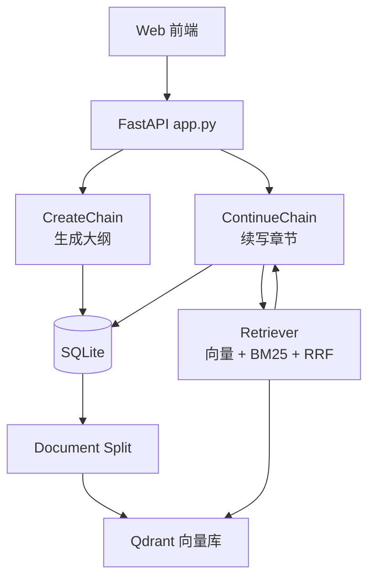

# NovelistAgent - Qdrant

<div align="center">


### 📚 一个面向中文网文创作的 Agent 写作平台

从「创作设定」到「章节续写」再到「导出成稿」，通过 **FastAPI + LangGraph + RAG** 完成小说创作闭环。

</div>

---

## ✨ 项目亮点

- 🧠 **双链路 Agent 设计**：
  - 创建链（CreateChain）：生成标题、简介、人物、章节大纲。
  - 续写链（ContinueChain）：基于 RAG 检索结果生成下一章并自审。
- 🔎 **混合检索 RAG**：向量检索 + BM25 稀疏检索 + RRF 融合，提升上下文召回稳定性。
- 🗂️ **结构化数据管理**：SQLite 持久化小说元信息、角色、章节摘要与正文。
- 🌐 **可视化创作界面**：书架页 / 新建页 / 详情页 / 续写工作台，前后端一体。
- 📝 **支持导出**：可导出 `.txt` 和 `.md` 成稿到本地 `output/`。

---

## 🧱 技术栈

- **后端**：FastAPI, Uvicorn
- **Agent 编排**：LangGraph
- **LLM 调用**：OpenAI SDK（兼容 OpenAI 风格 API）
- **RAG**：
  - 文档切分：`langchain-text-splitters`
  - 向量化：`langchain-huggingface` + `sentence-transformers`
  - 向量库：Qdrant（`qdrant-client`, `langchain-qdrant`）
  - 稀疏检索：`rank-bm25`
  - 融合：RRF（Reciprocal Rank Fusion）
- **数据存储**：SQLite
- **前端**：原生 HTML/CSS/JavaScript（无框架）

---

## 🏗️ 系统架构（简化）



---

## 🚀 快速开始

### 1. 安装依赖

```bash
pip install -r requirements.txt
```

> 说明：当前代码中使用了 `qdrant-client` 与 `langchain-qdrant`，建议确认它们已安装（若未在 `requirements.txt` 中可手动补充）。

### 2. 配置环境变量

在项目根目录创建/修改 `.env`（仅示例，不要提交真实密钥）：

```env
LLM_API_KEY=your_api_key
LLM_MODEL_ID=your_model_id
LLM_BASE_URL=optional_base_url

HUGGINGFACEEMBEDDINGS_MODEL=sentence-transformers/all-MiniLM-L6-v2

NOVEL_SKILL_ENABLED=1
NOVEL_SKILL_PATH=skills/chinese-novelist-skill-master/chinese-novelist-skill-master/SKILL.md
NOVEL_SKILL_MAX_CHARS=8000
```

### 3. 初始化数据库（首次）

使用 `data/init_novel_tables_sqlite.sql` 初始化 `data/novel.db` 三张核心表。

### 4. 启动服务

```bash
python main.py
```

浏览器访问：`http://127.0.0.1:8000`

---

## 🧭 主要功能流程

1. 在 `/create` 输入文风和需求，调用 `CreateChain` 生成小说草稿。
2. 保存草稿到 SQLite（作品信息 + 角色 + 章节摘要）。
3. 在 `/continue` 发起“续写需求”，系统先检索再生成新章节。
4. 审阅通过后保存章节正文。
5. 在详情页执行完结、导出成 `.txt` / `.md`。

---

## 🔌 API 概览

| 方法 | 路径 | 说明 |
|---|---|---|
| `GET` | `/api/novels` | 获取小说列表 |
| `GET` | `/api/novels/new-id` | 生成新的小说 ID |
| `POST` | `/api/agent/generate-draft` | 生成小说初始草稿 |
| `POST` | `/api/novels` | 保存新小说 |
| `GET` | `/api/novels/{novel_id}` | 获取小说详情 |
| `PUT` | `/api/novels/{novel_id}` | 更新小说内容 |
| `POST` | `/api/novels/{novel_id}/continue-draft` | 续写下一章草稿 |
| `POST` | `/api/novels/{novel_id}/chapters` | 保存新章节 |
| `POST` | `/api/novels/{novel_id}/complete` | 标记小说完结 |
| `POST` | `/api/novels/{novel_id}/export` | 导出作品为 TXT/Markdown |

---

## 📁 文件与目录说明（重点）

### 根目录

| 文件/目录 | 作用 |
|---|---|
| `main.py` | Uvicorn 启动入口（开发调试入口）。 |
| `app.py` | FastAPI 主程序：路由、数据库读写、导出、调用 Agent 链。 |
| `requirements.txt` | Python 依赖声明。 |
| `.env` | 模型、检索、技能开关等环境变量。 |
| `test_rag.py` | RAG 端到端测试脚本（检索调试与结果打印）。 |
| `temp.py` | 早期/备用 RAG 测试脚本（可作为实验脚本参考）。 |
| `output/` | 导出的小说文本与 Markdown 文件。 |
| `.vscode/` | 本地编辑器配置。 |

### `agent/`（智能体核心）

| 文件 | 作用 |
|---|---|
| `agent/agent.py` | 两条 LangGraph 工作流：`CreateChain` 与 `ContinueChain`，包含生成-审查迭代、JSON 解析兜底、RAG 检索接入。 |
| `agent/prompt.py` | 创建/续写/审稿/检索分析等系统提示词模板。 |
| `agent/llm.py` | OpenAI 风格模型调用封装（读取 `.env`，统一 `invoke` 接口）。 |
| `agent/skill_loader.py` | 外部小说技能文本加载与裁剪，注入 Prompt 上下文。 |

### `rag/`（检索增强生成）

| 文件 | 作用 |
|---|---|
| `rag/document_split.py` | 从 SQLite 提取章节数据，构建摘要文档与正文分块文档。 |
| `rag/vector_store.py` | 构建/连接 Qdrant 向量库并写入文档向量。 |
| `rag/retriever.py` | 混合检索实现：向量检索 + BM25 + RRF 融合，按 `novel_id` / `chapter_id` 过滤。 |

### `web/`（前端页面）

| 文件 | 作用 |
|---|---|
| `web/index.html` | 书架首页：展示作品卡片，进入创建或详情页。 |
| `web/create.html` | 新建作品页：输入需求、生成草稿、保存作品。 |
| `web/detail.html` | 详情页：查看人物/章节/全文，完结与导出。 |
| `web/write.html` | 续写工作台：编辑基础信息、发起续写、确认保存章节。 |
| `web/styles.css` | 全局主题与视觉样式（木质书架风格）。 |

### `data/`（数据）

| 文件/目录 | 作用 |
|---|---|
| `data/init_novel_tables_sqlite.sql` | SQLite 初始化脚本（3 张核心业务表）。 |
| `data/novel.db` | 小说业务数据库。 |
| `data/chroma/` | 历史向量库数据目录（已有索引/持久化文件）。 |

### `skills/`

| 目录 | 作用 |
|---|---|
| `skills/chinese-novelist-skill-master/...` | 中文小说创作技能（规则、参考资料、脚本、素材）。 |

---

## 🗃️ 数据库模型（SQLite）

- `chapter_outlines`：小说级信息（标题、简介、文风、完结状态）
- `character_profiles`：角色设定（角色名、人物小传）
- `chapter_summaries`：章节信息（标题、摘要、正文、字数）

---

## 🧪 调试与测试

运行 RAG 调试脚本：

```bash
python test_rag.py --query "主角与反派冲突" --novel-id 100001
```

用于验证：
- 文档是否成功切分
- 向量库是否可用
- 摘要与正文块是否能命中且章节约束合理

---

## ⚠️ 当前注意事项

- `rag/vector_store.py` 中目前写死了 Qdrant 连接信息（URL / API Key），建议立即改成环境变量方式，避免泄漏风险。
- `requirements.txt` 与实际导入库可能存在小幅差异，建议同步补齐 Qdrant 相关依赖。
- 项目中存在 `__pycache__/` 与临时测试脚本，后续可通过 `.gitignore` 进一步整理。

---

## 🎀 小贴纸区

<div align="center">


`✍️` `📖` `🧩` `🪄` `🌙`

</div>

---

## 🙌 致谢

这个项目非常适合继续扩展为：
- 多模型路由（不同模型负责大纲/续写/审稿）
- 多租户小说空间
- 更强的章节一致性检测与知识图谱

如果你愿意，我下一步可以继续帮你补一版：
1. 自动生成 `.env.example`
2. 对齐 `requirements.txt`（补齐缺失依赖）
3. 给 README 增加“接口请求示例 JSON”章节
